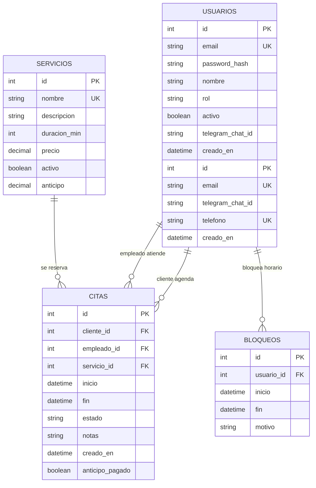

# Modelo de datos

```mermaid
erDiagram
    USUARIOS ||--o{ CITAS : "cliente agenda"
    USUARIOS ||--o{ CITAS : "empleado atiende"
    SERVICIOS ||--o{ CITAS : "se reserva"
    USUARIOS ||--o{ BLOQUEOS : "bloquea horario"

    USUARIOS {
        int id PK
        string email UK
        string password_hash
        string nombre
        string rol
        boolean activo
        string telegram_chat_id
        datetime creado_en
    }
    SERVICIOS {
        int id PK
        string nombre UK
        string descripcion
        int duracion_min
        decimal precio
        boolean activo
        decimal anticipo
    }
    CITAS {
        int id PK
        int cliente_id FK
        int empleado_id FK
        int servicio_id FK
        datetime inicio
        datetime fin
        string estado
        string notas
        datetime creado_en
        boolean anticipo_pagado
    }
    BLOQUEOS {
        int id PK
        int usuario_id FK
        datetime inicio
        datetime fin
        string motivo
    }

        USUARIOS {
        int id PK
        string email UK
                string telegram_chat_id
        string telefono UK
        datetime creado_en
    }
    
```